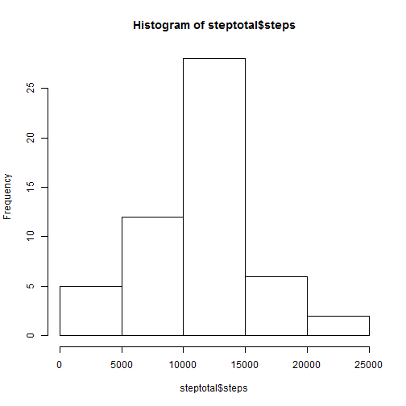
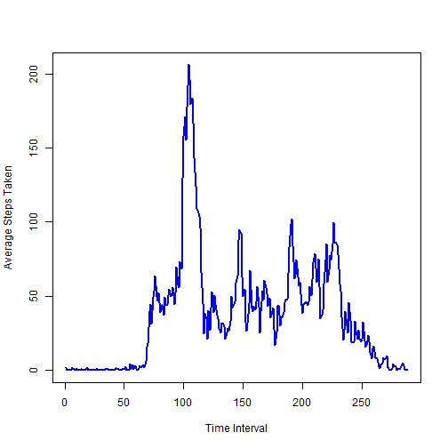
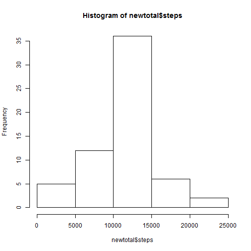
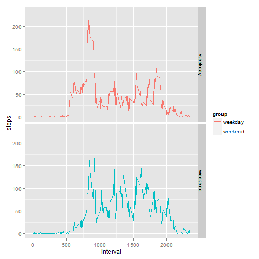

This is the Week 2 Project for Peer Assessment. The dataset is the "Activity monitoring data." 

Load that csv file.

```r
df <- read.csv("./activity.csv")
```

First, we need to get rid of all the NA's.

```r
df1 <- subset(df, df$steps !="NA")
```

Now we want to calculate the total steps per day,

so that we can then find the mean and median total steps per day.

```r
steptotal <- aggregate(.~date,data=df1,sum)
stepmean <- mean(steptotal$steps)
stepmedian <- median(steptotal$steps)
stepmean
```

```
## [1] 10766.19
```

```r
stepmedian
```

```
## [1] 10765
```


Then we want to graph a histogram of the frequency of total steps per day.

```r
hist(steptotal$steps)
```

 

Now we want to see the average steps taken by time interval, for all days.

```r
avetime <- aggregate(.~interval,data=df1,mean)
```


Now graph average steps taken by time interval.

```r
plot(avetime$steps, avetime$interval., type="l", xlab= "Time Interval", 
     ylab= "Average Steps Taken", col="blue" , lwd=2)
```

 


Which 5-minute interval, on average across the dataset, contains the maximum number of steps?

```r
avetime[which.max(avetime[,2]),1]
```

```
## [1] 835
```


How many rows in the original dataset contained NA's?

```r
sum(is.na(df$steps))
```

```
## [1] 2304
```


Now we'll plug in imputed averages for NAs according to the time interval, and save as a new dataset.

This is the code that impute the mean and replace the NA value.

```r
library(plyr)
impute <- function(x, fun) {
  missing <- is.na(x)
  replace(x, missing, fun(x[!missing]))
}
imputeddf<-ddply(df, ~ interval, transform, steps = impute(steps, mean))
newtotal <- aggregate(.~date,data=imputeddf,sum)
```


The mean and median of the new dataset are as follows.

```r
mean(newtotal$steps)
```

```
## [1] 10766.19
```

```r
median(newtotal$steps)
```

```
## [1] 10766.19
```
These values are consistent with the mean and median above.

Imputed the means for NA value made very little difference.


And the histogram of the new dataset is as follows.

```r
hist(newtotal$steps)
```

 

This histogram is distributed the same as before, 

but the frequency is higher due to more days of data.

Using the new dataset with imputed values, separate the data by weekdays/weekends.

Then aggregate the mean steps per time interval.

```r
weekdays <- c('Monday', 'Tuesday', 'Wednesday', 'Thursday', 'Friday')
imputeddf$date <- as.Date(imputeddf$date)
imputeddf$daygroup <- c('weekend', 'weekday')[(weekdays(imputeddf$date) %in% weekdays)+1L]
weekdaysonly <- subset(imputeddf, imputeddf$daygroup=="weekday")
weekendsonly <- subset(imputeddf, imputeddf$daygroup=="weekend")
weekdaymeans <- aggregate(.~interval,data=weekdaysonly[1:3],mean)
weekdaymeans <- weekdaymeans[1:2]
weekdaymeans <- cbind(weekdaymeans, group="weekday")
weekendmeans <- aggregate(.~interval,data=weekendsonly[1:3],mean)
weekendmeans <- weekendmeans[1:2]
weekendmeans <- cbind(weekendmeans, group="weekend")
weekly <- rbind(weekdaymeans, weekendmeans)
```


Now plot the time series for average steps by interval, separating weekdays from weekends.

```r
library(ggplot2)
ggplot(weekly, aes(interval, steps, color=group))+facet_grid(group ~ .)+geom_line()
```

 

We can see from the data that people are slower on average to get up and moving on weekends,

but they are more active throughout the rest of the day.


End of report.
